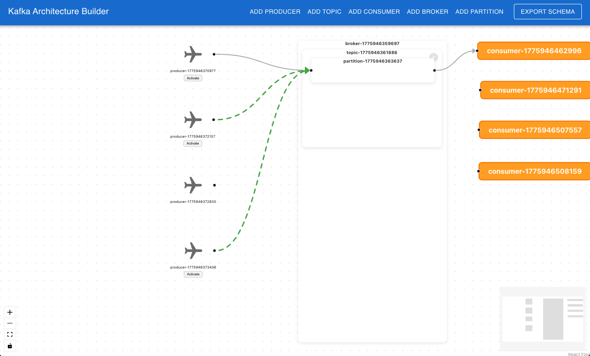

# Skytrac Kafka UI

## Application Overview

### Kafka Architecture Builder Interface



The Skytrac Kafka UI provides an intuitive interface for designing and managing Kafka architectures with visual node-based editing, real-time connection management, and animated data flow visualization.

## Commands

### Install Dependencies

```bash
npm install
```

Install all required dependencies for the project.

### Build for Production

```bash
npm run build
```

Builds the app for production to the `build` folder. The build is minified and ready for deployment.

### Start Development Server

```bash
npm run start
```

Runs the app in development mode. Open [http://localhost:3000](http://localhost:3000) to view it in the browser.
